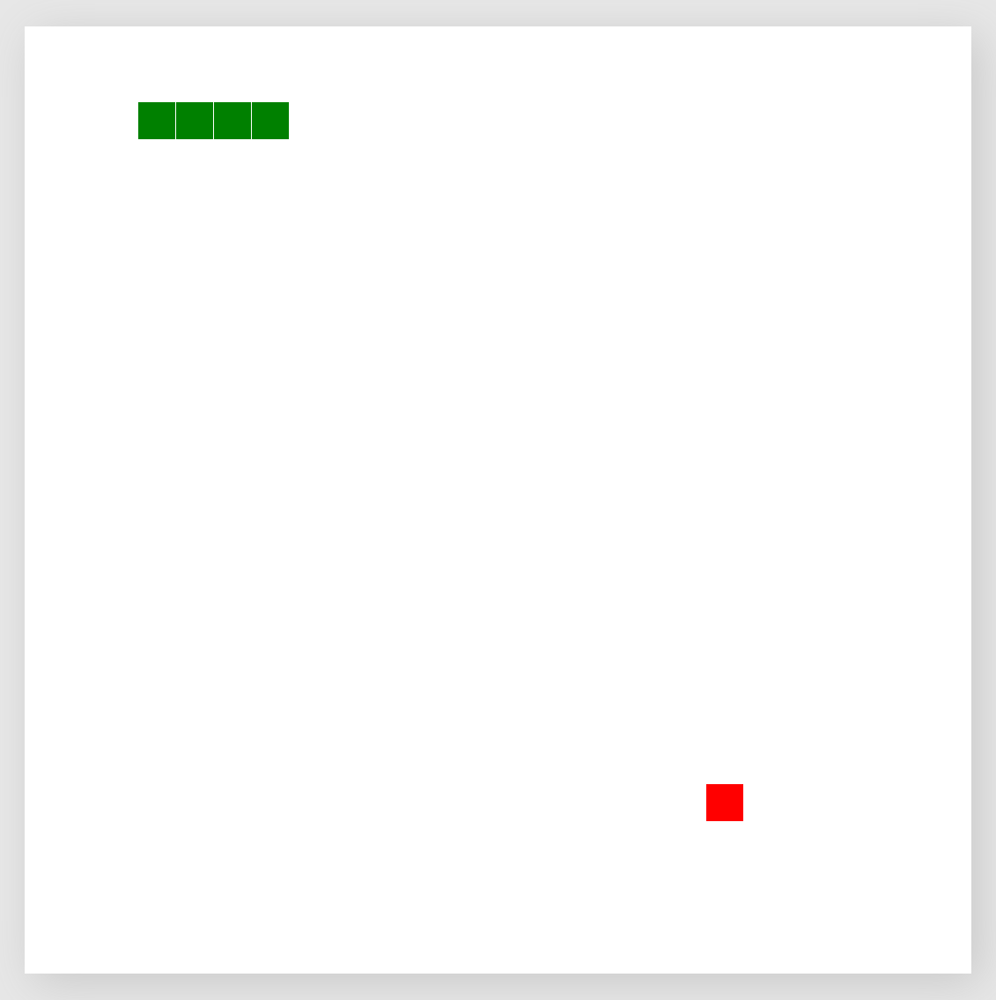

# mobileComputingWebsite

## Exercise

Create a website with HTML, CSS and JavaScript and also use a mobile service like geo location, camera or any other

## Demo

Get a demo here: https://rocklyve.github.io/mobileComputingWebsite

My example uses the game snake, where you can move with your **arrow keys** on the desktop machine and with your **device movement** on the mobile phone. 

It uses the **magnification** to find out the direction, your phone is tilted the most and in this direction, the snake is looking forward.

## Screenshot

